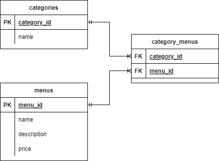

# GIGIH Restaurant
This is a final project from Generasi GIGIH 2.0 Back-end track, build an web app fullstack using Ruby and web framework Ruby on Rails. This project should be manage a restaurant with in can add category, add menu, and related features about ordering food.

# Project spec
* Rails version 7.0.2.3
* ruby 3.0.3p157 (2021-11-24) [x86_64-linux]
* sqlite3

## Getting Started
### Steps to run this locally or on Replit
```bash
# install the required libraries and depenencies
$ bundle install

# run the database migrations
$ rails db:migrate

# start the local server
$ rails server or bin/rails s
```

## ERD Design Database

